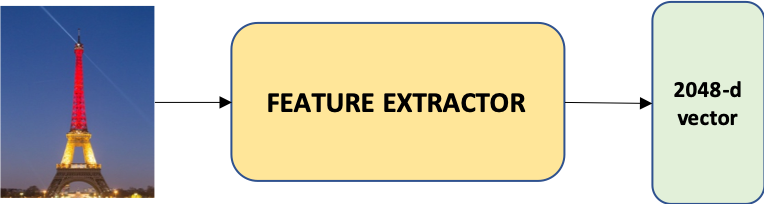
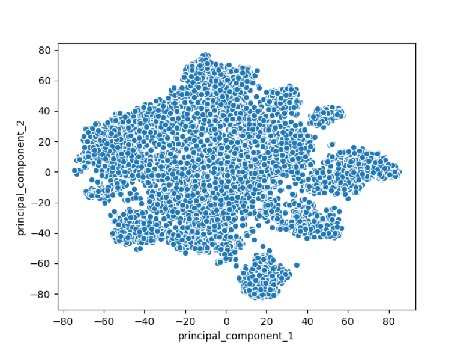
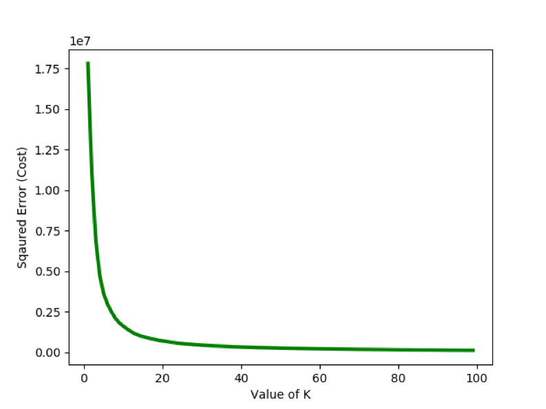

# Image clustering

Clustering is an interesting field of Unsupervised Machine learning where I classify dataset into set of similar groups. I use Image Clustering when I have thousands of images and are desirable to find a way to group (or categorize) them into subsets which share similarity. 

This work is aimed at performing clustering images using k-means clustering, Inception feature extractor and dimension reduction.


## Installation

### Clone the repo

```python
git clone https://github.com/tringn/image_clustering.git
```


### Install required packages

This project is using `python3.7` and `pip3`

```python
pip install -r requirements.txt
```

## Process

### Step 1: Feature extractor

I use the feature extractor of InceptionV3 model, which was trained on ImageNet datatset (contains 14,197,122 images: http://www.image-net.org/) to ensure the feature extractor can extract the characteristics for various object. 



You need to download extractor model first

```python
python build_data.py
``` 

I used all images crawled from champselysees_paris Instagram ()

You can crawl champselysees_paris images or you can use your own images.

Move all all images into 1 folder `raw/data/example` 

Then extracting features by running:
```python
python extract_features.py
``` 

### Step 2: Dimension reduction

2048 dimension vectors prevent the clustering process to converge at optimal points, so I apply dimension reduction method to seize the dimension of images' vectors to 2. 

I divide the dimension reduction into 2 steps: reducing from 2048 to 50 and from 50 to 2. The reason why I did that is because "It is highly recommended to use another dimensionality reduction method (e.g. PCA for dense data or TruncatedSVD for sparse data) to reduce the number of dimensions to a reasonable amount (e.g. 50) if the number of features is very high."


After reducing dimension to 2, the images' distribution of object is plotted as follow:



**The script for this step is combined with step 3.1**

### Step 3: Clustering using K-Means

Question now is how to choose the number of cluster to assign all images of object into. I have no pre-definition how many subset that images of object belong to because the images crawled from the Internet are chaotically distributed.

I apply the elbow curve method to determine the best number of cluster as described below:

#### Step 3.1: Find the best K clusters

I iterate k from 1 to 100. From k = 1 to k = 40, the Squared Error decreases significantly. From k = 40 to k = 100, there is a slight fall in Squared Error compared with previous changes. So I choose k = 40 that is the best number of cluster.



Run following script to reduce feature dimension and find best number of k.

```python
python find_k.py
``` 

Go to `visualization/example/cost_2D.png` to find the best value of K (where cost decrease much more little compared with previous)

#### Step 3.2: Cluster images into k subsets

I use k-means algorithm to assign all images in the object collection into 40 subsets (k=40 is selected at above step).

Set value for `k` at `configs/congigs.json` and run:

```python
python run_k_mean.py
``` 

Images will be clustered and linked to `results/link/example`

Output for **example** is shown as below:

